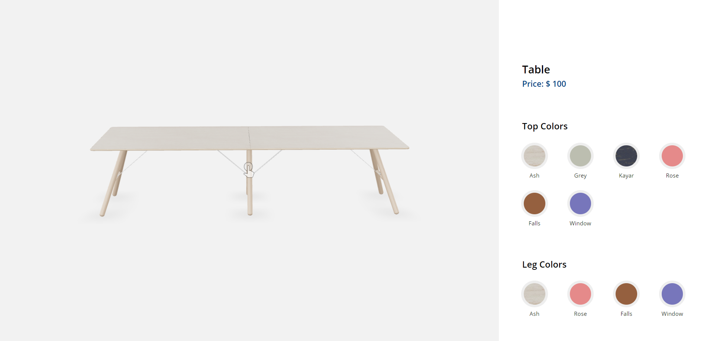

# Simple Product Configurator for a Table

## Overview

This is a simple static page product configurator for a table. It's currently not meant to be used for any other model due to potential issues with `configurator.js`. Changing materials might require modifications in `configurator.js` for any other model.

To make it more dynamic for any model, we need to set up a JSON-like structure where the model can store its changeable material/mesh info that can be fetched directly. A Content Management Platform (CMP) will also be needed to make it more dynamic.

## How to Run

You can use any of the methods below:

- Direct deploy to Netlify.
- Live Server extension by Ritwick Dey is a great choice.
- Any simple server can host.

## Deployed Link

https://worktest-3d.netlify.app/

##Demo Screenshots

Desktop

Mobile
